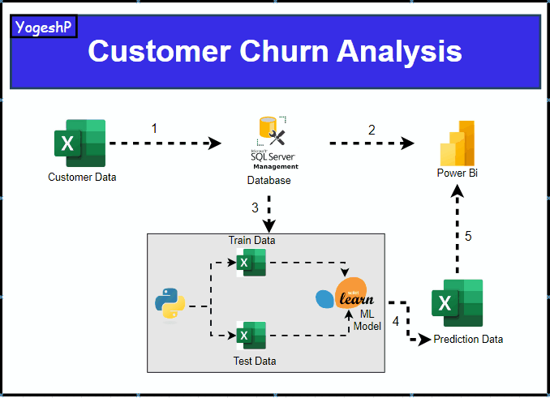
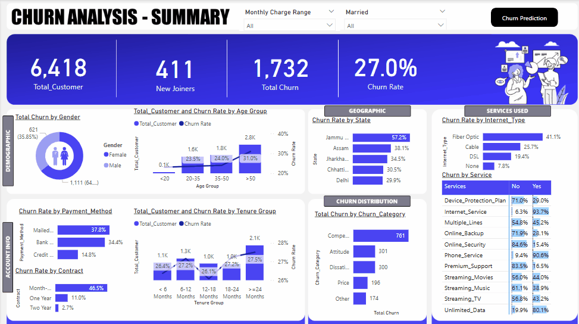

# 📊 Customer Churn Prediction

This project predicts customer churn using **Logistic Regression** and **Random Forest**. It includes data preprocessing, model training, evaluation, and feature selection using feature importance.

---

## 🚀 Project Overview

Customer churn prediction is essential for businesses to retain customers. This project involves:

1️⃣ **Customer Data Collection**

- Data is stored in an Excel file and imported into an SQL Server database.

2️⃣ **Data Storage & Processing**

- SQL Server is used for querying and preprocessing data.

3️⃣ **Model Training & Evaluation**

- Trains **Logistic Regression** and **Random Forest** models.
- Uses **Confusion Matrix**, **Classification Report**, and **Accuracy Score** for evaluation.

4️⃣ **Feature Selection**

- Identifies key factors affecting customer churn using feature importance.

5️⃣ **Prediction & Visualization**

- Stores prediction data in an Excel file.
- Visualizes churn insights using Power BI.

---
### 🔹 Workflow Diagram


---

## 📂 Dataset

The dataset contains customer details and subscription information. Key columns include:

- **Categorical Features:** Gender, Internet Type, Contract Type, Payment Method, etc.
- **Numerical Features:** Monthly Charges, Total Charges, Tenure, etc.
- **Target Variable:** `Customer_Status` (0 = Stayed, 1 = Churned)

---
### 🔹 Power Bi Churn Analysis Summary


---
### 🔹 Power Bi Churn Analysis Prediction


---
## ⚡ Installation

### 1️⃣ Clone the Repository

```bash
git clone https://github.com/your-username/customer-churn-prediction.git
cd customer-churn-prediction
```

### 2️⃣ Install Dependencies

```bash
pip install pandas scikit-learn matplotlib seaborn joblib
```

### 3️⃣ Run the Model

```bash
python churn_prediction.py
```

---

## 🔍 Model Comparison

### ✅ **Confusion Matrices**

| Model                   | True Positives | True Negatives | False Positives | False Negatives |
| ----------------------- | -------------- | -------------- | --------------- | --------------- |
| **Random Forest**       | 353            | 1177           | 78              | 195             |
| **Logistic Regression** | 350            | 1117           | 138             | 198             |

### ✅ **Model Performance**

| Model                   | Accuracy | Precision (Churn) | Recall (Churn) | F1-Score (Churn) |
| ----------------------- | -------- | ----------------- | -------------- | ---------------- |
| **Random Forest**       | 84.85%   | 82%               | 64%            | 72%              |
| **Logistic Regression** | 81.36%   | 72%               | 64%            | 68%              |

🔹 **Random Forest performs better** due to its ability to handle non-linearity in data.

---

## 📊 Feature Importance

Random Forest provides **feature importance scores**, identifying the most relevant features for predicting churn.

### 🔹 **Top Features**

| Feature            | Importance Score |
| ------------------ | ---------------- |
| `Contract`         | 0.27             |
| `Tenure`           | 0.22             |
| `Monthly Charges`  | 0.18             |
| `Internet Service` | 0.12             |

### 📉 **Feature Importance Plot**


---

## 📌 Next Steps

- ✅ Optimize hyperparameters using GridSearchCV.
- ✅ Try other models like XGBoost, SVM, or Neural Networks.
- ✅ Deploy the model as a REST API using Flask.

---

## 👨‍💻 Author

**Your Name**

- 📧 Email: [pahujayogesh.s@gmail.com](mailto\:pahujayogesh.s@gmail.com)
- 🔗 [LinkedIn](https://www.linkedin.com/in/yogesh-pahuja-a452251b2)

---

## 📊 Summary of Workflow

1️⃣ Collect data (Excel → SQL Server).\
2️⃣ Train models (Logistic Regression & Random Forest).\
3️⃣ Evaluate models using accuracy & confusion matrix.\
4️⃣ Identify key features with feature importance.\
5️⃣ Predict churn & visualize insights in Power BI.

---

